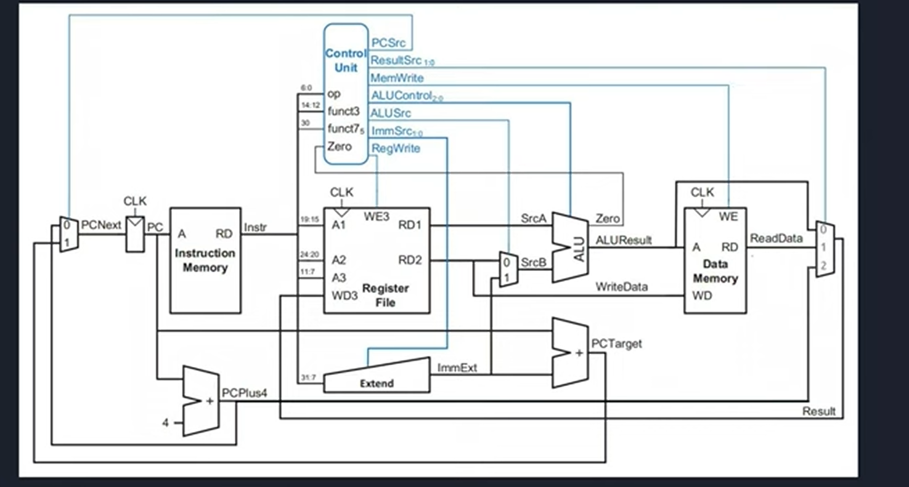

# RISC-V Single-Cycle Processor

A Verilog-based single-cycle RISC-V processor based on concepts from *Digital Design and Computer Architecture: RISC-V Edition* by Harris & Harris.

The processor is developed and verified incrementally using **Icarus Verilog** and **GTKWave**.

## Architecture


## Current Status

The processor is currently implemented and tested for a subset of the RV32I instruction set.

Currently implemented and tested:

* R-type instructions
* I-type arithmetic and logical instructions
* `LW` — Load Word
* `SW` — Store Word
* `BEQ` — Branch if Equal
* `JAL` — Jump and Link
* `JALR` — Jump and Link Register
* Immediate generation for I-type, S-type, B-type, and J-type instructions
* PC update logic for sequential execution, branches, and jumps
* Register write-back for ALU results, load data, and `PC + 4`
* JALR target alignment by clearing bit 0 of the calculated target address
* Basic event-driven testbench for processor-level verification

The processor has been tested through simulation using Icarus Verilog, with waveforms inspected using GTKWave.

## Project Structure

```text
single_cycle_riscv/
│
├── rtl/
│   ├── alu.v
│   ├── alu_decoder.v
│   ├── and_pc_src.v
│   ├── data_mem.v
│   ├── extender.v
│   ├── instr_memory.v
│   ├── jalr_pc_mux.v
│   ├── main_decoder.v
│   ├── mux_srcb.v
│   ├── or_pc_src.v
│   ├── pc.v
│   ├── pc_inc.v
│   ├── pc_mux.v
│   ├── pc_target.v
│   ├── register_file.v
│   ├── result_mux.v
│   └── single_cycle_top.v
│
├── tb/
│   ├── alu_ctrl_tb.v
│   ├── alu_tb.v
│   ├── event_driven_top_tb.v
│   ├── extender_tb.v
│   ├── instr_mem_tb.v
│   ├── pc_inst_tb.v
│   ├── pc_tb.v
│   ├── register_tb.v
│   └── top_tb.v
│
├── programs/
│   ├── b_type_test.hex
│   ├── combined_rilw_test.hex
│   ├── i_type_load_test.hex
│   ├── i_type_test.hex
│   ├── r_type_test.hex
│   ├── s_type_test.hex
│   ├── j_type_test.hex
│   └── i_jalr_type_test.hex
│
├── .gitignore
└── README.md
```

### Directory Description

| Directory   | Description                                             |
| ----------- | ------------------------------------------------------- |
| `rtl/`      | Processor RTL modules                                   |
| `tb/`       | Module-level and processor-level testbenches            |
| `programs/` | RISC-V machine-code test programs in hexadecimal format |

## Simulation

The project uses:

* **Icarus Verilog** for compilation and simulation
* **GTKWave** for waveform analysis

Example simulation command:

```bash
iverilog -o toptest.out rtl/*.v tb/event_driven_top_tb.v
vvp toptest.out
```
## Future Work

Planned improvements include:

* Additional RV32I instructions
* More comprehensive processor-level test programs
* Improved self-checking testbench
* Further verification of the complete datapath and control logic
* Improved documentation and verification coverage

## Reference

*Digital Design and Computer Architecture: RISC-V Edition*
Sarah L. Harris and David Harris
